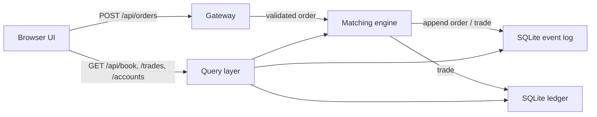

# Trade Engine

A compact, end-to-end trading-engine demonstration built with Python, FastAPI, SQLite, and a static browser UI. It accepts **BTCUSD limit orders**, matches them using **price-time priority**, records every accepted order and trade in an append-only event log, and settles matched trades through a versioned ledger.

> **Project scope:** This is an educational/reference implementation, not a production trading system and not financial software. It has no authentication, market-data integration, risk engine, fee model, or production-grade durability/availability controls.

## Highlights

- Limit orders for the `BTCUSD` symbol
- Price-time priority with FIFO ordering at each price level
- Partial fills and sweeping across multiple price levels
- Cancellation of resting orders
- SQLite-backed, append-only event log and in-memory order-book replay on startup
- Atomic two-party settlement with optimistic concurrency control (OCC) and bounded retries
- REST API for submitting/cancelling orders and reading book, trade, and account state
- A single-page UI that polls the API for book depth, trades, and balances
- Unit, integration, end-to-end, crash-recovery, and concurrency-stress test coverage

## Architecture



### Components

| Component | Responsibility |
| --- | --- |
| Gateway | Validates the request, allowed symbol, account existence, buying cash, or selling holdings before passing an order to the engine. |
| Matching engine | Maintains one order book per symbol, creates trades, and handles cancellations. |
| Order book | Uses sorted price levels and FIFO queues to implement price-time priority. Bid keys are stored negated to preserve descending bid order. |
| Event log | Stores ordered `order`, `trade`, and `cancel` records in SQLite. At startup, the engine replays orders and cancellations to restore resting-book state. |
| Ledger | Applies each trade to buyer and seller balances in one SQLite transaction using account version checks and retries. |
| Query layer | Exposes aggregated top-of-book depth, recent trades, and account balances as read-only API endpoints. |
| Frontend | Static HTML/CSS/JavaScript served by FastAPI; it contains presentation logic only and polls every two seconds. |

## Matching rules

The engine supports only integer-priced, integer-quantity limit orders. For an incoming order:

1. The order is written to the event log.
2. It matches the best available prices on the opposite side while the prices cross.
3. Each fill uses the **resting order's price**.
4. Orders at the same price are matched in FIFO order.
5. Fully filled resting orders leave the book; any unfilled incoming quantity rests on the book.
6. Generated trades are logged and then sent to settlement.

Example: a resting sell for `10 @ 100` receives a buy for `5 @ 100`. The result is one trade for `5 @ 100`, leaving `5 @ 100` on the ask side.

## Repository layout

```text
Trade_Engine/
├── Architecture.md             # Design and build specification
└── matching-engine/
    ├── api/                    # FastAPI application, gateway, query endpoints
    ├── engine/                 # Domain models, matching engine, order book
    ├── eventlog/               # SQLite append-only event log
    ├── settlement/             # SQLite ledger with OCC settlement
    ├── frontend/               # Static single-page trading UI
    ├── tests/                  # Unit, integration, E2E, stress, and load tests
    ├── event_log.db            # Local runtime event-log database (if present)
    └── ledger.db               # Local runtime ledger database (if present)
```

## Requirements

- Python 3.11 or newer
- `pip`

Runtime dependencies:

- `fastapi`
- `uvicorn`
- `pydantic`
- `sortedcontainers`

Development/test dependencies:

- `pytest`
- `httpx`

## Quick start

```bash
git clone https://github.com/kaushik66/Trade_Engine.git
cd Trade_Engine/matching-engine

python3 -m venv .venv
source .venv/bin/activate           # Windows: .venv\\Scripts\\activate
python -m pip install --upgrade pip
python -m pip install fastapi "uvicorn[standard]" pydantic sortedcontainers pytest httpx
```

### Create demo accounts (fresh database)

The API deliberately has no account-creation endpoint. Before placing orders against a fresh `ledger.db`, provision the demo accounts below from `matching-engine/`:

```bash
python - <<'PY'
from settlement.ledger import Ledger

ledger = Ledger("ledger.db")
ledger.create_account("alice", initial_cash=10_000, initial_holdings={"BTCUSD": 0})
ledger.create_account("bob", initial_cash=0, initial_holdings={"BTCUSD": 50})
print("Created alice and bob")
PY
```

If you rerun the snippet against the same database, SQLite will reject duplicate account IDs. Delete only the local `ledger.db` and `event_log.db` when you intentionally want to reset local state.

### Run the application

```bash
uvicorn api.main:app --reload
```

Open [http://127.0.0.1:8000](http://127.0.0.1:8000) for the UI or [http://127.0.0.1:8000/docs](http://127.0.0.1:8000/docs) for the generated OpenAPI documentation.

The application reads `DB_DIR` at startup. Set it to keep runtime databases outside the project directory:

```bash
DB_DIR=/path/to/local-data uvicorn api.main:app --reload
```

`DB_DIR` must already exist. The server creates `event_log.db` and `ledger.db` in that directory when needed.

## API reference

### Submit a limit order

`POST /api/orders`

```json
{
  "account_id": "bob",
  "side": "sell",
  "symbol": "BTCUSD",
  "price": 100,
  "quantity": 5
}
```

Successful requests return HTTP `201`:

```json
{
  "order_id": "<uuid>",
  "status": "accepted",
  "fills": [],
  "remaining_quantity": 5
}
```

Validation rejects unknown accounts, symbols other than `BTCUSD`, non-positive price/quantity, insufficient cash for buys, and insufficient holdings for sells. The request model accepts integer `price` and `quantity` values only.

### Cancel a resting order

`DELETE /api/orders/{order_id}?symbol=BTCUSD`

A cancellation succeeds only while the order remains on the book. Filled, unknown, or already cancelled orders return HTTP `404`.

### Read order-book depth

`GET /api/book/{symbol}`

The response aggregates up to ten bid and ask price levels:

```json
{
  "symbol": "BTCUSD",
  "bids": [{"price": 99, "total_quantity": 4}],
  "asks": [{"price": 100, "total_quantity": 5}]
}
```

### Read recent trades

`GET /api/trades?symbol=BTCUSD&limit=50`

Returns matching trade events in newest-first order. The query scans the event log and filters by symbol.

### Read an account

`GET /api/accounts/{account_id}`

```json
{
  "account_id": "alice",
  "cash_balance": 9700,
  "holdings": {"BTCUSD": 3},
  "version": 2
}
```

## End-to-end example

With the server running and `alice`/`bob` provisioned:

```bash
# Bob rests an ask.
curl -X POST http://127.0.0.1:8000/api/orders \
  -H 'Content-Type: application/json' \
  -d '{"account_id":"bob","side":"sell","symbol":"BTCUSD","price":100,"quantity":5}'

# Alice crosses the ask and buys three units.
curl -X POST http://127.0.0.1:8000/api/orders \
  -H 'Content-Type: application/json' \
  -d '{"account_id":"alice","side":"buy","symbol":"BTCUSD","price":100,"quantity":3}'

curl 'http://127.0.0.1:8000/api/book/BTCUSD'
curl 'http://127.0.0.1:8000/api/trades?symbol=BTCUSD'
curl 'http://127.0.0.1:8000/api/accounts/alice'
```

The fill executes at the resting ask price (`100`). Alice's cash decreases by `300` and BTCUSD holdings increase by `3`; Bob's balances change in the opposite direction. Two units remain on the ask.

## Persistence and recovery

The event log uses an SQLite table with an auto-incrementing sequence number. `order` events are written before matching; each resulting `trade` event is written before settlement begins. SQLite transaction boundaries prevent committed partial log entries.

On application startup, `MatchingEngine.restore_from_log()` rebuilds in-memory order books by replaying logged orders and cancellations. Trades are deterministic outputs of order replay and are not separately applied to the book during restoration.

## Settlement and concurrency

Each account has a `version`, cash balance, and symbol holdings. For every trade, the ledger:

1. Reads buyer and seller accounts inside a SQLite transaction.
2. Checks that the resulting cash and holdings remain non-negative.
3. Updates both accounts only when their stored versions still match the values read.
4. Commits both updates together, or rolls back and retries when a conflict or SQLite lock occurs.
5. Raises `SettlementRetryExhausted` after the configured retry limit.

This is an optimistic-concurrency demonstration. In the HTTP gateway, a settlement retry failure is recorded as a `settlement_failed` event and returned as HTTP `500`.

## Testing

Run the test suite from `matching-engine/`:

```bash
pytest -q
```

The suite covers:

- price-time matching, partial fills, multi-level sweeps, cancellation, and quantity conservation;
- ordered event-log reads and recovery from an interrupted uncommitted write;
- order/trade event wiring and order-book replay;
- FastAPI end-to-end order, query, validation, and settlement flow;
- concurrent settlement correctness across repeated runs.

### Current test-suite note

At the repository revision documented here, the suite has a known mismatch: `Trade` now requires `buyer_account_id` and `seller_account_id`, but `tests/test_settlement.py` and `tests/test_stress.py` construct `Trade` without those two fields. Consequently, `pytest -q` reports 12 passing and 3 failing tests, all with a `TypeError` during test setup. The matching, event-log, integration, and end-to-end tests pass. Update those test fixtures (or make the fields optional only if that fits the intended model) before treating the full suite as green.

### Load test

Start the server first, then run:

```bash
python tests/load_test.py
```

The harness submits 1,000 alternating BTCUSD buy/sell orders with concurrency 50 and prints elapsed time and orders per second. It resets the databases in `load_test_dbs/`; use that directory only for disposable load-test data.

## Design limitations and production considerations

This repository intentionally keeps the scope small. Before using a similar design beyond experimentation, consider:

- Authentication, authorization, account onboarding, and audit controls
- Stronger risk controls: reservations, buying-power checks, position limits, and idempotency keys
- A durable atomic relationship between trade creation and settlement; this implementation logs a trade before invoking settlement, so failed settlement requires explicit reconciliation
- Safe concurrent access to the in-memory matching engine and order book
- A production database, migrations, connection management, monitoring, and backups
- Decimal or fixed-point money handling with explicit currency/lot-size rules
- Additional order types, multi-symbol configuration, market data, and a real-time event stream
- A package manifest and pinned dependency versions for reproducible builds

## Further documentation

[Architecture.md](Architecture.md) describes the intended component boundaries, feature scope, algorithms, testing strategy, and build plan in greater depth.

## License

No license file is currently present in the repository. Add a license before redistributing or accepting external contributions.
